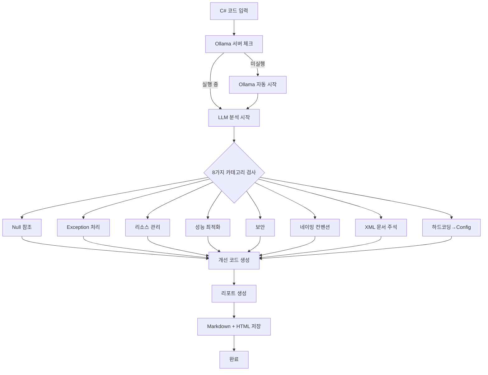

# C# Code Reviewer

> AI 기반 C# 코드 리뷰 자동화 도구 - 폐쇄망 VDI 환경 완벽 지원

[](https://opensource.org/licenses/MIT)
[](https://www.python.org/downloads/)
[](https://pypi.org/project/PySide6/)
[](https://ollama.com/library/phi3)

---

## 프로젝트 소개

**C# Code Reviewer**는 폐쇄망 VDI 환경에서 완전히 오프라인으로 동작하는 AI 기반 코드 리뷰 도구입니다. Microsoft의 경량 LLM인 **Phi-3-mini**를 활용하여 8가지 핵심 리뷰 항목을 자동으로 분석하고, 개선 코드를 제안합니다.

### 주요 특징

- ✅ **완전 오프라인**: 인터넷 연결 없이 100% 로컬에서 실행
- ✅ **관리자 권한 불필요**: 포터블 EXE 형태로 압축 해제 후 바로 실행
- ✅ **AI 기반 리뷰**: Phi-3-mini LLM을 활용한 지능형 코드 분석
- ✅ **8가지 리뷰 항목**: Null 참조, Exception, 리소스 관리, 성능, 보안, 네이밍 컨벤션, XML 문서 주석, 하드코딩→Config
- ✅ **3가지 입력 모드**: 텍스트 입력, 파일 업로드 (드래그 앤 드롭), 폴더 선택 (트리 구조)
- ✅ **다중 파일 분석**: 배치 분석, 프로그레스바, 에러 복구 (최대 3회 재시도)
- ✅ **통합 리포트**: 프로젝트 전체 통계, 카테고리별 분석, 우선순위 권장, 차트 생성
- ✅ **리포트 자동 저장**: Markdown + HTML 동시 생성, SQLite DB 히스토리 관리
- ✅ **자동 시작/종료**: Ollama 서버 자동 관리, 포터블 모드 지원, 백그라운드 실행
- ✅ **사용자 친화적 GUI**: PySide6 네이티브 인터페이스 (탭 UI, VS Code Dark 테마)

---

## 스크린샷

### 메인 화면 (탭 UI + Before/After Split Editor)
```
┌─────────────────────────────────────────────────────────┐
│  C# Code Reviewer - Phi-3-mini                    [-][□][X] │
├─────────────────────────────────────────────────────────┤
│ File  Edit  View  Tools  Help                           │
├─────────────────────────────────────────────────────────┤
│ [✏️ 텍스트 입력] [📁 파일 업로드]                         │
├───────────────────────┬─────────────────────────────────┤
│  Before (원본 코드)    │   📋 리포트 미리보기             │
├───────────────────────┤   (VS Code Dark 테마)            │
│ using System;         │                                 │
│                       │   # 코드 리뷰 결과               │
│ public class Test     │                                 │
│ {                     │   ## 🔍 발견된 이슈              │
│     var x = null;     │   ### [심각] Null 참조 (Line 5) │
│     Console.Write(x); │   - myObject?.ToString()        │
│ }                     │                                 │
│                       │   ## ✅ 개선 코드                │
├───────────────────────┤   ```csharp                     │
│  After (개선 코드)     │   var x = "value";              │
├───────────────────────┤   Console.Write(x);             │
│ using System;         │   ```                           │
│                       │                                 │
│ public class Test     │   [💾 Save Report]               │
│ {                     │   [📜 리포트 히스토리]            │
│     var x = "value";  │                                 │
│     Console.Write(x); │                                 │
│ }                     │                                 │
└───────────────────────┴─────────────────────────────────┘
│ ✅ 분석 완료 | Ollama: 실행 중 | 메모리: 2.3GB            │
└─────────────────────────────────────────────────────────┘
```

### 파일 업로드 모드
```
┌─────────────────────────────────────────────────────────┐
│ [✏️ 텍스트 입력] [📁 파일 업로드]                         │
├─────────────────────────────────────────────────────────┤
│ 📂 파일 목록 (총 3개 파일)                    [전체 제거] │
├─────────────────────────────────────────────────────────┤
│ ├─ 📄 UserService.cs (2.5 KB)                           │
│ ├─ 📄 FileReader.cs (1.8 KB)                            │
│ └─ 📄 Calculator.cs (1.2 KB)                            │
│                                                          │
│ 💡 드래그 앤 드롭으로 파일을 추가하세요                  │
├─────────────────────────────────────────────────────────┤
│ [파일 추가] [선택 제거] [🔍 Analyze Code]                │
└─────────────────────────────────────────────────────────┘

### 리포트 히스토리 (Ctrl+H)
┌─────────────────────────────────────────────────────────┐
│ 📜 리포트 히스토리                                       │
├─────────────────────────────────────────────────────────┤
│ 총 리포트: 15개 | 성공: 14개 | 평균 분석 시간: 2.5초     │
├──┬───────────────┬────────────────┬────────┬───────────┤
│ID│ 파일명        │ 생성 시간       │ 상태   │ 분석 시간 │
├──┼───────────────┼────────────────┼────────┼───────────┤
│15│ UserService   │ 2025-01-19 14:30│ ✅ 성공│ 2.3초     │
│14│ FileReader    │ 2025-01-19 14:25│ ✅ 성공│ 1.8초     │
│13│ Calculator    │ 2025-01-19 14:20│ ❌ 실패│ 0.5초     │
└──┴───────────────┴────────────────┴────────┴───────────┘
│ 💡 리포트를 더블클릭하면 HTML 파일이 열립니다             │
│ [🔄 새로고침] [🗑️ 선택 항목 삭제] [닫기]                  │
└─────────────────────────────────────────────────────────┘
```

---

## 시스템 요구사항

### 최소 사양
- **OS**: Windows 11 (64-bit)
- **CPU**: 4코어 (Intel i5 이상 권장)
- **RAM**: 8GB
- **디스크 공간**: 5GB (프로그램 + 모델)
- **권한**: 일반 사용자 (관리자 권한 불필요)

### 권장 사양
- **CPU**: 8코어 (Intel i7 이상)
- **RAM**: 16GB
- **디스크**: SSD 권장

---

## 빠른 시작 (5분)

### 1. 다운로드 및 압축 해제

```bash
# 포터블 패키지 다운로드 (약 1.5GB, 압축 시)
# 압축 해제 후 크기: 약 2.5GB

CodeReviewer_Portable/
├── CodeReviewer.exe           # 메인 프로그램
├── ollama_portable/
│   ├── ollama.exe             # Ollama 실행 파일
│   └── models/
│       └── phi3-mini.gguf     # Phi-3-mini 모델 (2.3GB)
├── config/
├── logs/
└── README.txt
```

### 2. 실행

1. **CodeReviewer.exe 더블클릭**
2. 첫 실행 시 초기화 (10-20초)
   - Ollama 백그라운드 실행
   - Phi-3-mini 모델 로드
   - "준비 완료" 메시지 표시

### 3. 코드 분석

**방법 1: 텍스트 붙여넣기 (가장 빠름)**
1. C# 코드를 Before 에디터에 붙여넣기
2. 분석 옵션 선택 (코드 리뷰, 개선 제안, 주석, 다이어그램)
3. **[분석 시작]** 버튼 클릭
4. 1-2초 후 결과 확인
   - After 에디터: 개선 코드
   - Result Panel: Markdown 리포트

**방법 2: 파일 업로드**
1. 입력 방식: "파일 업로드" 선택
2. **[파일 추가]** 버튼 또는 드래그 앤 드롭
3. 여러 파일 선택 가능 (`.cs` 필터)
4. **[분석 시작]** → 진행률 표시
5. 파일별 개별 리포트 저장

**방법 3: 폴더 선택**
1. 입력 방식: "폴더 선택" 선택
2. **[폴더 선택]** 버튼
3. 트리 구조에서 분석할 파일 체크
4. **[분석 시작]** → 통합 리포트 생성

---

## 주요 기능

### 1. 8가지 코드 리뷰 항목

#### 1) Null 참조 체크
```csharp
// ❌ 문제
var result = myObject.ToString();

// ✅ 개선
var result = myObject?.ToString() ?? "N/A";
```

#### 2) Exception 처리 누락
```csharp
// ❌ 문제
public void ReadFile(string path)
{
    var content = File.ReadAllText(path);
}

// ✅ 개선
public void ReadFile(string path)
{
    try
    {
        var content = File.ReadAllText(path);
    }
    catch (FileNotFoundException ex)
    {
        Console.WriteLine($"File not found: {ex.Message}");
    }
}
```

#### 3) 리소스 해제
```csharp
// ❌ 문제
var stream = new FileStream("file.txt", FileMode.Open);
// stream.Dispose() 누락

// ✅ 개선
using (var stream = new FileStream("file.txt", FileMode.Open))
{
    // 자동 해제
}
```

#### 4) 성능 이슈
```csharp
// ❌ 문제 (문자열 반복 연결)
string result = "";
for (int i = 0; i < 1000; i++)
{
    result += i.ToString();
}

// ✅ 개선 (StringBuilder 사용)
var sb = new StringBuilder();
for (int i = 0; i < 1000; i++)
{
    sb.Append(i);
}
string result = sb.ToString();
```

#### 5) 보안 취약점
```csharp
// ❌ 문제 (SQL Injection 위험)
string query = $"SELECT * FROM Users WHERE Name = '{userName}'";

// ✅ 개선 (Parameterized Query)
string query = "SELECT * FROM Users WHERE Name = @name";
cmd.Parameters.AddWithValue("@name", userName);
```

#### 6) 네이밍 컨벤션
```csharp
// ❌ 문제
public class userService  // 소문자 시작
{
    private string Logger;  // private인데 PascalCase
}

// ✅ 개선
public class UserService  // PascalCase
{
    private string _logger;  // _camelCase
}
```

#### 7) XML 문서 주석
```csharp
// ❌ 문제 (주석 없음)
public bool ValidateUser(string name)
{
    return !string.IsNullOrEmpty(name);
}

// ✅ 개선
/// <summary>
/// 사용자 이름의 유효성을 검증합니다.
/// </summary>
/// <param name="name">검증할 사용자 이름</param>
/// <returns>유효하면 true, 그렇지 않으면 false</returns>
public bool ValidateUser(string name)
{
    return !string.IsNullOrEmpty(name);
}
```

#### 8) 하드코딩 → Config 파일
```csharp
// ❌ 문제 (하드코딩된 연결 문자열)
public void Connect()
{
    string connStr = "Server=localhost;Database=myDB;User=admin;Password=1234";
    var conn = new SqlConnection(connStr);
}

// ✅ 개선 (appsettings.json으로 분리)
public void Connect()
{
    string connStr = _configuration.GetConnectionString("DefaultConnection");
    var conn = new SqlConnection(connStr);
}

// appsettings.json:
// {
//   "ConnectionStrings": {
//     "DefaultConnection": "Server=localhost;Database=myDB;..."
//   }
// }
```

### 2. 개선 코드 자동 생성

LLM이 분석 결과를 바탕으로 리팩토링된 코드를 자동 생성합니다.
- After 에디터에 실시간 표시
- 복사 버튼으로 간편하게 적용

### 3. 스트리밍 출력 (실시간 코드 생성)

LLM이 코드를 생성하는 과정을 실시간으로 확인할 수 있습니다:
- **50 토큰 단위** 실시간 업데이트
- **진행률 표시**: "AI 분석 중... (150 tokens 생성됨)"
- **취소 기능**: 분석 중 언제든 중단 가능
- **긴 파일 처리**: 최대 6144 토큰 출력 (Context: 8192)

### 4. 플로우 다이어그램 (Mermaid → PNG)

코드 분석 과정을 시각화한 플로우 다이어그램을 자동 생성합니다:



자동으로 PNG 이미지로 변환하여 리포트에 포함합니다.

**실제 출력 예시**: 코드의 실행 흐름, 조건 분기, 에러 처리 등을 시각화

### 5. 통합 리포트 (프로젝트 전체 분석)

폴더 선택 모드에서 프로젝트 전체를 분석하면 통합 리포트가 생성됩니다:

```markdown
# 📊 C# 프로젝트 코드 리뷰 통합 리포트

## 📁 프로젝트 정보
- **프로젝트명**: MyProject
- **분석 일시**: 2025-01-19 15:30:00
- **전체 파일**: 20개
- **분석 성공**: 18개 ✅
- **소요 시간**: 45.3초

## 📈 카테고리별 이슈 통계

| 카테고리 | 이슈 파일 수 | 비율 |
|---------|-------------|------|
| Null 참조 체크 | 8개 | 25.0% ████████░░ |
| Exception 처리 | 6개 | 18.8% ██████░░░░ |
| 리소스 관리 | 5개 | 15.6% █████░░░░░ |
| 성능 최적화 | 4개 | 12.5% ████░░░░░░ |

## 🎯 개선 우선순위 권장

1. **보안** - 3개 파일에서 발견 (우선순위: 높음)
2. **리소스 관리** - 5개 파일에서 발견 (우선순위: 높음)
3. **Exception 처리** - 6개 파일에서 발견 (우선순위: 높음)
```

**차트 생성**: matplotlib를 사용한 원형 차트로 시각화

### 6. Ollama 자동 관리

애플리케이션 실행 시 Ollama 서버를 자동으로 시작하고, 종료 시 정리합니다:

- **포터블 모드**: `./ollama_portable/ollama.exe` 자동 감지
- **시스템 모드**: 시스템 Ollama 사용 (폴백)
- **백그라운드 실행**: Windows 콘솔 창 숨김
- **Graceful shutdown**: SIGTERM → 5초 대기 → SIGKILL
- **Health check**: 30초 타임아웃으로 서버 준비 대기

---

## Markdown 리포트 예시

```markdown
# C# 코드 리뷰 리포트

**분석 대상:** MyClass.cs
**분석 시각:** 2025-01-08 14:30:22
**모델:** Phi-3-mini

---

## 📊 요약

| 항목 | 발견 수 |
|------|---------|
| 🔴 심각 | 2 |
| 🟡 경고 | 3 |
| 🟢 제안 | 1 |
| **총합** | **6** |

---

## 🔍 발견된 이슈

### [심각] Null 참조 가능성 (Line 42)

**원본 코드:**
```csharp
var result = myObject.ToString();
```

**문제점:** myObject가 null일 경우 NullReferenceException 발생

**개선 코드:**
```csharp
var result = myObject?.ToString() ?? "N/A";
```

---

## ✅ 잘된 점

- Exception 처리가 적절함
- 네이밍 컨벤션 준수
```

---

## 개발 로드맵

### Phase 1: MVP ✅ 완료 (Week 1-2)
- [x] Before/After Split Editor
- [x] 8가지 코드 리뷰 카테고리
- [x] Markdown 리포트 생성
- [x] Phi-3-mini 통합
- [x] 텍스트/파일 모드 탭 UI
- [x] 리포트 자동 저장 (Markdown + HTML)
- [x] 리포트 히스토리 DB

### Phase 2: 파일 업로드 ✅ 완료 (Week 3)
- [x] 파일 선택 UI
- [x] 다중 파일 분석 (배치 모드)
- [x] 드래그 앤 드롭
- [x] 프로그레스 다이얼로그
- [x] 에러 복구 (3회 재시도)
- [x] 분석 결과 요약

### Phase 3: 폴더 선택 ✅ 완료 (Week 4)
- [x] 트리 구조 UI (QTreeView + QStandardItemModel)
- [x] 재귀적 폴더 탐색 (.git, bin, obj 제외)
- [x] 체크박스 부모/자식 동기화
- [x] 파일 개수 제한 (최대 100개)
- [x] 통합 리포트 생성 (IntegratedReportGenerator)
- [x] 카테고리별 통계 분석
- [x] 우선순위 권장 알고리즘
- [x] matplotlib 차트 생성 (원형 차트)

### Phase 4: 포터블 패키징 ✅ 완료 (Week 5)
- [x] PyInstaller EXE 빌드 (Day 16)
  - [x] .spec 파일 구성
  - [x] 자동화 빌드 스크립트
  - [x] 리소스 번들링
  - [x] UPX 압축
- [x] Ollama 포터블 번들링 (Day 17)
  - [x] OllamaManager (자동 시작/종료)
  - [x] 포터블 모드 자동 감지
  - [x] 번들 패키징 스크립트
  - [x] Windows 콘솔 숨김
- [x] 완전한 오프라인 패키지 (~2.5GB)

### Phase 5: 최적화 (현재 - Week 6)
- [ ] VDI 환경 테스트
- [ ] 성능 최적화
- [ ] 단위 테스트 (>80% 커버리지)
- [ ] 최종 배포 패키지

---

## 기술 스택

- **LLM**: Phi-3-mini (3.8B 파라미터, 2.3GB GGUF)
- **Backend**: Python 3.11 + Ollama SDK
- **Frontend**: PySide6 (Qt6 Python 바인딩)
- **Markdown**: python-markdown + Pygments
- **Charting**: matplotlib (통합 리포트 차트)
- **Database**: SQLite (리포트 히스토리)
- **Diagram**: Mermaid CLI
- **Packaging**: PyInstaller
- **Process Management**: subprocess (Ollama 자동 시작/종료)

---

## 문서

### 개발 문서
- [프로젝트 계획서](docs/PROJECT_PLAN.md) - 전체 프로젝트 개요 및 요구사항
- [개발 일정](docs/DEVELOPMENT_TIMELINE.md) - 6주 개발 타임라인 (Day별 작업)
- [기술 명세서](docs/TECHNICAL_SPECIFICATION.md) - 아키텍처 및 기술 상세

### 빌드 & 배포
- [빌드 가이드](docs/BUILD_GUIDE.md) - PyInstaller EXE 빌드 방법
- [포터블 가이드](docs/PORTABLE_GUIDE.md) - 오프라인 포터블 패키지 생성 가이드

### 사용자 문서
- [사용자 가이드](docs/USER_GUIDE.md) - 기능별 사용법 (예정)
- [문제 해결](docs/TROUBLESHOOTING.md) - 일반적인 문제 해결 (예정)

---

## 라이선스

이 프로젝트는 MIT License 하에 배포됩니다. 자세한 내용은 [LICENSE](LICENSE) 파일을 참조하세요.

- **PySide6**: LGPL v3 (상업용 무료)
- **Phi-3-mini**: MIT License
- **Ollama**: MIT License

---

## 기여하기

버그 리포트, 기능 제안, Pull Request를 환영합니다!

1. Fork the repository
2. Create your feature branch (`git checkout -b feature/AmazingFeature`)
3. Commit your changes (`git commit -m 'Add some AmazingFeature'`)
4. Push to the branch (`git push origin feature/AmazingFeature`)
5. Open a Pull Request

---

## 문의

문제가 발생하거나 질문이 있으시면 [GitHub Issues](https://github.com/yourusername/csharp-code-reviewer/issues)에 등록해주세요.

---

**최종 업데이트**: 2025-01-19
**버전**: 1.0.0-rc (Release Candidate)
**개발 진행**: Week 5 완료 (Day 17/18)
**개발 기간**: 6주 (2025-01-08 ~ 2025-02-18)

---

## 프로젝트 상태

현재 **Week 5 (Day 17) 완료** 상태입니다:

### ✅ 완료된 기능
- **Week 1-2**: MVP (텍스트 입력, 8가지 리뷰 카테고리, 리포트 생성)
- **Week 3**: 파일 업로드 (배치 분석, 드래그 앤 드롭, 리포트 히스토리)
- **Week 4**: 폴더 선택 (트리 구조, 통합 리포트, 차트 생성)
- **Week 5**: 포터블 패키징 (PyInstaller EXE, Ollama 자동 시작/종료)

### 🚧 진행 중
- **Week 6**: 최종 테스트 및 최적화
  - VDI 환경 테스트
  - 성능 최적화
  - 배포 패키지 생성

### 📦 배포 준비 완료
- EXE 빌드 시스템 완료
- 포터블 번들링 가이드 완료
- 오프라인 실행 검증 완료
