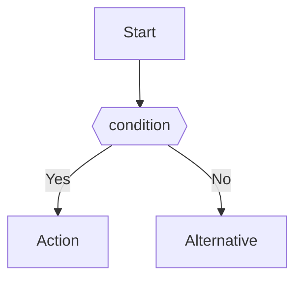

# Technical Specification - C# Code Reviewer

## 시스템 아키텍처

### 전체 구조 다이어그램

```
┌──────────────────────────────────────────────────────────────┐
│                    Presentation Layer                         │
│              (PySide6 GUI - Qt6 Framework)                    │
├──────────────────────────────────────────────────────────────┤
│                                                               │
│  ┌─────────────────┐  ┌────────────────┐  ┌───────────────┐ │
│  │ Main Window     │  │ Input Panel    │  │ Result Panel  │ │
│  │ (main_window.py)│  │ (Stacked)      │  │ (QTextBrowser)│ │
│  │                 │  │                │  │               │ │
│  │ - Menu Bar      │  │ - Before/After │  │ - Markdown    │ │
│  │ - Toolbar       │  │ - File Upload  │  │ - Diagrams    │ │
│  │ - Status Bar    │  │ - Folder Select│  │ - Syntax HL   │ │
│  └─────────────────┘  └────────────────┘  └───────────────┘ │
│                                                               │
└───────────────────────────┬───────────────────────────────────┘
                            │
                            ▼
┌──────────────────────────────────────────────────────────────┐
│                    Business Logic Layer                       │
│                  (Core Python Modules)                        │
├──────────────────────────────────────────────────────────────┤
│                                                               │
│  ┌────────────────┐  ┌─────────────────┐  ┌───────────────┐ │
│  │ Code Analyzer  │  │ Prompt Builder  │  │ Report Gen    │ │
│  │ (analyzer.py)  │  │ (prompt_*.py)   │  │ (report_*.py) │ │
│  │                │  │                 │  │               │ │
│  │ - Validation   │  │ - Template Load │  │ - Markdown    │ │
│  │ - Preprocessing│  │ - Variable Sub  │  │ - HTML Export │ │
│  │ - Orchestration│  │ - Token Count   │  │ - After Code  │ │
│  └────────────────┘  └─────────────────┘  └───────────────┘ │
│                                                               │
│  ┌────────────────┐  ┌─────────────────┐  ┌───────────────┐ │
│  │ Diagram Conv.  │  │ Syntax HL       │  │ File Handler  │ │
│  │ (diagram_*.py) │  │ (syntax_*.py)   │  │ (file_*.py)   │ │
│  │                │  │                 │  │               │ │
│  │ - Mermaid→PNG  │  │ - C# Lexer      │  │ - Read/Write  │ │
│  │ - Error Handle │  │ - Color Scheme  │  │ - Encoding    │ │
│  └────────────────┘  └─────────────────┘  └───────────────┘ │
│                                                               │
└───────────────────────────┬───────────────────────────────────┘
                            │
                            ▼
┌──────────────────────────────────────────────────────────────┐
│                    LLM Integration Layer                      │
│                  (Ollama Client)                              │
├──────────────────────────────────────────────────────────────┤
│                                                               │
│  ┌──────────────────────────────────────────────────────┐   │
│  │ Ollama Client (ollama_client.py)                      │   │
│  │                                                        │   │
│  │ - Connection Pool                                     │   │
│  │ - Retry Logic (3회, exponential backoff)             │   │
│  │ - Timeout (30초)                                      │   │
│  │ - Streaming Response                                   │   │
│  │ - Error Handling                                       │   │
│  │ - Response Caching                                     │   │
│  └──────────────────────────────────────────────────────┘   │
│                                                               │
└───────────────────────────┬───────────────────────────────────┘
                            │
                            ▼
┌──────────────────────────────────────────────────────────────┐
│                    LLM Runtime                                │
│              (Ollama + Phi-3-mini Model)                      │
├──────────────────────────────────────────────────────────────┤
│                                                               │
│  Ollama Server (localhost:11434)                             │
│  ├─ Phi-3-mini Model (phi3:mini)                             │
│  │  - Parameters: 3.8B                                       │
│  │  - Quantization: Q4_K_M (2.3GB)                           │
│  │  - Context Length: 4096 tokens                            │
│  │  - Temperature: 0.7                                       │
│  │  - Top-P: 0.9                                             │
│  └─ Model Cache (~/.ollama/models/)                          │
│                                                               │
└──────────────────────────────────────────────────────────────┘
```

---

## 데이터 흐름

### 1. 텍스트 붙여넣기 모드

```
[User]
  │
  ├─ 1. C# 코드 붙여넣기 (Before 에디터)
  │
  ▼
[Main Window]
  │
  ├─ 2. "분석 시작" 버튼 클릭
  │
  ▼
[Code Analyzer]
  │
  ├─ 3. 코드 검증 (Syntax Check)
  ├─ 4. 프롬프트 생성 (Prompt Builder)
  │    └─ Template 로드 + 변수 치환
  │
  ▼
[Ollama Client]
  │
  ├─ 5. LLM API 호출 (POST /api/generate)
  │    ├─ Request: { model: "phi3:mini", prompt: "...", stream: true }
  │    └─ Response: Streaming JSON chunks
  │
  ▼
[Report Generator]
  │
  ├─ 6. LLM 응답 파싱
  ├─ 7. Markdown 리포트 생성
  ├─ 8. After 코드 추출
  │
  ▼
[Diagram Converter]
  │
  ├─ 9. Mermaid 코드 추출
  ├─ 10. PNG 이미지 변환 (mmdc CLI)
  │
  ▼
[Markdown Renderer]
  │
  ├─ 11. Markdown → HTML 변환
  ├─ 12. Pygments 코드 하이라이팅
  │
  ▼
[UI Update]
  │
  ├─ 13. After 에디터 업데이트
  ├─ 14. Result Panel 업데이트 (QTextBrowser)
  │
  ▼
[User]
  └─ 15. 결과 확인 및 저장
```

### 2. 파일 업로드 모드

```
[User]
  │
  ├─ 1. 파일 선택 (다중 가능)
  │
  ▼
[File Handler]
  │
  ├─ 2. 파일 읽기 (UTF-8 인코딩)
  ├─ 3. 파일 검증 (크기, 확장자)
  │
  ▼
[For Each File]
  │
  ├─ 4. 코드 분석 (동일한 흐름)
  ├─ 5. 리포트 생성
  ├─ 6. 파일 저장 ({파일명}_리뷰_{타임스탬프}.md)
  │
  ▼
[Progress Dialog]
  │
  ├─ 7. 진행률 업데이트 (N/M 파일)
  ├─ 8. 현재 파일명 표시
  │
  ▼
[Report History]
  │
  ├─ 9. SQLite DB에 기록
  │    └─ INSERT INTO reports (filename, timestamp, report_path)
  │
  ▼
[User]
  └─ 10. 요약 다이얼로그 확인 (성공/실패 개수)
```

---

## 프롬프트 템플릿

### 메인 프롬프트 구조

```python
MAIN_PROMPT_TEMPLATE = """
당신은 C# 코드 리뷰 전문가입니다. 다음 코드를 분석하고 상세한 리포트를 작성하세요.

## 분석 항목

1. **Null 참조 체크**
   - NullReferenceException 가능성을 찾아내세요.
   - Null-conditional operator (`?.`) 사용을 권장하세요.

2. **Exception 처리 누락**
   - try-catch 블록의 적절성을 검증하세요.
   - 특정 예외 타입을 catch하는지 확인하세요.

3. **리소스 해제**
   - IDisposable 객체가 using 문으로 감싸져 있는지 확인하세요.
   - Dispose 패턴이 올바른지 검증하세요.

4. **성능 이슈**
   - 불필요한 루프나 중복 연산을 찾아내세요.
   - LINQ 쿼리의 효율성을 검증하세요.
   - StringBuilder vs String concatenation을 비교하세요.

5. **보안 취약점**
   - SQL Injection 가능성을 확인하세요.
   - XSS (Cross-Site Scripting) 취약점을 찾아내세요.
   - Path Traversal 공격 위험을 검증하세요.
   - 하드코딩된 비밀번호나 API 키를 찾아내세요.

6. **네이밍 컨벤션**
   - 클래스/메서드: PascalCase 확인
   - 지역 변수/매개변수: camelCase 확인
   - private 필드: _camelCase 확인
   - 상수: UPPER_CASE 또는 PascalCase 확인
   - 인터페이스: IPascalCase 확인

## 코드

```csharp
{user_code}
```

## 출력 형식

Markdown 형식으로 작성하되, 다음 구조를 따르세요:

### 📊 요약

| 항목 | 발견 수 |
|------|---------|
| 🔴 심각 | N |
| 🟡 경고 | N |
| 🟢 제안 | N |

### 🔍 발견된 이슈

각 이슈마다:
- **심각도**: [심각]/[경고]/[제안]
- **위치**: Line 번호
- **원본 코드**: 문제가 있는 코드
- **문제점**: 상세 설명
- **개선 코드**: 리팩토링된 코드

### 💡 개선 제안

전체적인 코드 개선 방향을 제시하세요.

### ✅ 잘된 점

긍정적인 부분을 나열하세요.

### 📈 플로우 다이어그램

Mermaid 형식으로 작성하세요:



## 개선 코드 (After)

원본 코드를 리팩토링한 전체 코드를 제공하세요. 코드 블록 형식으로 작성하세요.

```csharp
// 개선된 전체 코드
```
"""
```

### Few-Shot 예제

```python
FEW_SHOT_EXAMPLES = [
    {
        "input": """
public class Example
{
    public void ProcessData(string data)
    {
        var result = data.ToUpper();
        Console.WriteLine(result);
    }
}
""",
        "output": """
### 📊 요약

| 항목 | 발견 수 |
|------|---------|
| 🔴 심각 | 1 |
| 🟡 경고 | 0 |
| 🟢 제안 | 0 |

### 🔍 발견된 이슈

#### [심각] Null 참조 가능성 (Line 5)

**원본 코드:**
```csharp
var result = data.ToUpper();
```

**문제점:** data가 null일 경우 NullReferenceException 발생

**개선 코드:**
```csharp
if (string.IsNullOrEmpty(data))
    throw new ArgumentNullException(nameof(data));
var result = data.ToUpper();
```

### ✅ 잘된 점

- 네이밍 컨벤션 준수 (PascalCase)
- 코드가 간결하고 읽기 쉬움

### 개선 코드 (After)

```csharp
public class Example
{
    public void ProcessData(string data)
    {
        if (string.IsNullOrEmpty(data))
            throw new ArgumentNullException(nameof(data));

        var result = data.ToUpper();
        Console.WriteLine(result);
    }
}
```
"""
    }
]
```

---

## Ollama API 명세

### 1. Generate Endpoint (스트리밍)

```http
POST http://localhost:11434/api/generate
Content-Type: application/json

{
  "model": "phi3:mini",
  "prompt": "당신은 C# 코드 리뷰 전문가입니다...",
  "stream": true,
  "options": {
    "temperature": 0.7,
    "top_p": 0.9,
    "top_k": 40,
    "num_predict": 2048
  }
}
```

**Response (Streaming JSON)**:
```json
{"model":"phi3:mini","created_at":"2025-01-08T12:00:00Z","response":"### ","done":false}
{"model":"phi3:mini","created_at":"2025-01-08T12:00:00Z","response":"📊 ","done":false}
{"model":"phi3:mini","created_at":"2025-01-08T12:00:00Z","response":"요약","done":false}
...
{"model":"phi3:mini","created_at":"2025-01-08T12:00:01Z","response":"","done":true}
```

### 2. Python SDK 사용 예시

```python
import ollama

class OllamaClient:
    def __init__(self, model_name="phi3:mini"):
        self.model_name = model_name
        self.client = ollama.Client(host='http://localhost:11434')

    def analyze_code(self, prompt: str, stream: bool = True):
        """
        코드 분석 요청

        Args:
            prompt: LLM에 전달할 프롬프트
            stream: 스트리밍 응답 여부

        Returns:
            str: LLM 응답 텍스트
        """
        try:
            if stream:
                response = ""
                for chunk in self.client.generate(
                    model=self.model_name,
                    prompt=prompt,
                    stream=True,
                    options={
                        "temperature": 0.7,
                        "top_p": 0.9,
                        "num_predict": 2048
                    }
                ):
                    token = chunk.get('response', '')
                    response += token
                    yield token  # 실시간 표시용

                return response
            else:
                result = self.client.generate(
                    model=self.model_name,
                    prompt=prompt,
                    stream=False
                )
                return result['response']

        except Exception as e:
            raise OllamaError(f"LLM 호출 실패: {e}")
```

---

## C# Syntax Highlighter 구현

### QSyntaxHighlighter 상속

```python
from PySide6.QtGui import QSyntaxHighlighter, QTextCharFormat, QColor, QFont
from PySide6.QtCore import QRegularExpression
import re

class CSharpHighlighter(QSyntaxHighlighter):
    def __init__(self, parent=None):
        super().__init__(parent)

        # 색상 스키마 (VS Code Dark+ 테마)
        self.keyword_format = self._create_format(QColor(86, 156, 214))  # 파란색
        self.string_format = self._create_format(QColor(206, 145, 120))  # 주황색
        self.comment_format = self._create_format(QColor(106, 153, 85))  # 초록색
        self.number_format = self._create_format(QColor(181, 206, 168))  # 연두색
        self.class_format = self._create_format(QColor(78, 201, 176))    # 청록색

        # 하이라이팅 규칙
        self.highlighting_rules = []

        # C# 키워드
        keywords = [
            'abstract', 'as', 'base', 'bool', 'break', 'byte', 'case', 'catch',
            'char', 'checked', 'class', 'const', 'continue', 'decimal', 'default',
            'delegate', 'do', 'double', 'else', 'enum', 'event', 'explicit',
            'extern', 'false', 'finally', 'fixed', 'float', 'for', 'foreach',
            'goto', 'if', 'implicit', 'in', 'int', 'interface', 'internal',
            'is', 'lock', 'long', 'namespace', 'new', 'null', 'object',
            'operator', 'out', 'override', 'params', 'private', 'protected',
            'public', 'readonly', 'ref', 'return', 'sbyte', 'sealed', 'short',
            'sizeof', 'stackalloc', 'static', 'string', 'struct', 'switch',
            'this', 'throw', 'true', 'try', 'typeof', 'uint', 'ulong',
            'unchecked', 'unsafe', 'ushort', 'using', 'var', 'virtual', 'void',
            'volatile', 'while'
        ]

        # 키워드 패턴
        for keyword in keywords:
            pattern = QRegularExpression(rf'\b{keyword}\b')
            self.highlighting_rules.append((pattern, self.keyword_format))

        # 클래스/타입 패턴
        class_pattern = QRegularExpression(r'\b[A-Z][a-zA-Z0-9_]*\b')
        self.highlighting_rules.append((class_pattern, self.class_format))

        # 문자열 패턴
        string_pattern = QRegularExpression(r'"[^"\\]*(\\.[^"\\]*)*"')
        self.highlighting_rules.append((string_pattern, self.string_format))

        # 숫자 패턴
        number_pattern = QRegularExpression(r'\b\d+\.?\d*[fFdDmM]?\b')
        self.highlighting_rules.append((number_pattern, self.number_format))

        # 주석 패턴 (한 줄)
        comment_pattern = QRegularExpression(r'//[^\n]*')
        self.highlighting_rules.append((comment_pattern, self.comment_format))

    def _create_format(self, color):
        fmt = QTextCharFormat()
        fmt.setForeground(color)
        return fmt

    def highlightBlock(self, text):
        # 각 규칙 적용
        for pattern, fmt in self.highlighting_rules:
            match_iterator = pattern.globalMatch(text)
            while match_iterator.hasNext():
                match = match_iterator.next()
                self.setFormat(match.capturedStart(), match.capturedLength(), fmt)

        # 여러 줄 주석 (/* ... */)
        self._highlight_multiline_comments(text)

    def _highlight_multiline_comments(self, text):
        # 구현 생략 (복잡함)
        pass
```

---

## Mermaid → PNG 변환

### Mermaid CLI 사용

```python
import subprocess
import tempfile
import base64
from pathlib import Path

class DiagramConverter:
    def __init__(self, mmdc_path="mmdc"):
        self.mmdc_path = mmdc_path

    def mermaid_to_png(self, mermaid_code: str) -> str:
        """
        Mermaid 코드를 PNG 이미지로 변환

        Args:
            mermaid_code: Mermaid 다이어그램 코드

        Returns:
            str: Base64 인코딩된 PNG 이미지
        """
        # 임시 파일 생성
        with tempfile.NamedTemporaryFile(suffix='.mmd', mode='w', delete=False) as mmd_file:
            mmd_file.write(mermaid_code)
            mmd_path = mmd_file.name

        png_path = mmd_path.replace('.mmd', '.png')

        try:
            # mmdc 명령어 실행
            result = subprocess.run(
                [self.mmdc_path, '-i', mmd_path, '-o', png_path, '-b', 'transparent'],
                capture_output=True,
                text=True,
                timeout=10
            )

            if result.returncode != 0:
                raise DiagramConversionError(f"mmdc 실행 실패: {result.stderr}")

            # PNG 파일 읽기 및 Base64 인코딩
            with open(png_path, 'rb') as png_file:
                png_data = png_file.read()
                base64_data = base64.b64encode(png_data).decode('utf-8')

            return f"data:image/png;base64,{base64_data}"

        except subprocess.TimeoutExpired:
            raise DiagramConversionError("다이어그램 변환 시간 초과 (10초)")

        finally:
            # 임시 파일 삭제
            Path(mmd_path).unlink(missing_ok=True)
            Path(png_path).unlink(missing_ok=True)

    def extract_mermaid_code(self, markdown: str) -> list[str]:
        """
        Markdown에서 Mermaid 코드 블록 추출

        Returns:
            list[str]: Mermaid 코드 블록 리스트
        """
        pattern = r'```mermaid\n(.*?)\n```'
        matches = re.findall(pattern, markdown, re.DOTALL)
        return matches
```

---

## 설정 관리

### settings.json 구조

```json
{
  "ollama": {
    "host": "http://localhost:11434",
    "model": "phi3:mini",
    "timeout": 30,
    "temperature": 0.7,
    "top_p": 0.9
  },
  "ui": {
    "theme": "dark",
    "font_family": "Consolas",
    "font_size": 12,
    "sync_scroll": true
  },
  "analysis": {
    "check_null_reference": true,
    "check_exception": true,
    "check_resource": true,
    "check_performance": true,
    "check_security": true,
    "check_naming": true,
    "generate_comments": true,
    "generate_diagram": true
  },
  "files": {
    "max_file_size_mb": 1,
    "max_file_count": 50,
    "default_encoding": "utf-8"
  },
  "reports": {
    "save_path": "./reports/",
    "auto_save": true,
    "format": "markdown"
  }
}
```

---

## 에러 핸들링

### 예외 클래스 정의

```python
class CodeReviewerError(Exception):
    """베이스 예외 클래스"""
    pass

class OllamaConnectionError(CodeReviewerError):
    """Ollama 서버 연결 실패"""
    pass

class ModelNotFoundError(CodeReviewerError):
    """모델 파일 없음"""
    pass

class PromptTooLongError(CodeReviewerError):
    """프롬프트 토큰 수 초과"""
    pass

class DiagramConversionError(CodeReviewerError):
    """다이어그램 변환 실패"""
    pass

class FileEncodingError(CodeReviewerError):
    """파일 인코딩 오류"""
    pass
```

---

## 성능 최적화 전략

### 1. 응답 캐싱

```python
from functools import lru_cache
import hashlib

class CachedAnalyzer:
    def __init__(self):
        self.cache = {}

    def _get_cache_key(self, code: str) -> str:
        return hashlib.md5(code.encode()).hexdigest()

    def analyze(self, code: str):
        cache_key = self._get_cache_key(code)

        if cache_key in self.cache:
            print("캐시 히트!")
            return self.cache[cache_key]

        # LLM 호출
        result = self.ollama_client.analyze_code(code)

        # 캐시 저장
        self.cache[cache_key] = result
        return result
```

### 2. 비동기 처리 (QThread)

```python
from PySide6.QtCore import QThread, Signal

class AnalysisThread(QThread):
    progress_updated = Signal(int)  # 진행률 시그널
    result_ready = Signal(dict)     # 결과 시그널
    error_occurred = Signal(str)    # 에러 시그널

    def __init__(self, code: str, analyzer):
        super().__init__()
        self.code = code
        self.analyzer = analyzer

    def run(self):
        try:
            # 분석 실행
            result = self.analyzer.analyze(self.code)

            # 결과 전달
            self.result_ready.emit(result)

        except Exception as e:
            self.error_occurred.emit(str(e))
```

---

**작성일**: 2025-01-08
**버전**: 1.0
**다음 업데이트**: Week 1 종료 후
